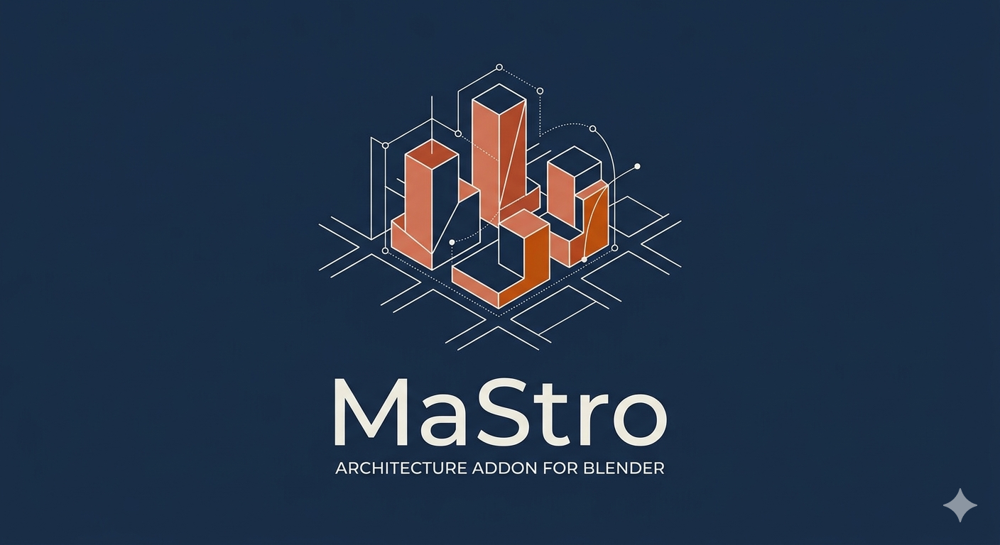

# Introduction

MaStro is a Blender extension designed for architects and anyone interested in rapidly creating fully parametric 3D architectural models.

The core idea is that the user models only the essentials — a schematic footprint — and assigns the parameters needed to define the volume: height, building type, usage. From there, Geometry Nodes takes care of the rest. This approach applies equally to tracing roads.

The extension operates on two levels: a Python component that manages the assignment of custom parameters to geometries, and a set of Geometry Nodes dedicated to modelling. The nodes are designed to quickly model architectural elements such as walls, façades, and openings, and to be extended — no extension can meet every user's needs.

MaStro has been tested on numerous architectural projects, ranging from single buildings with just a few floors to masterplans encompassing hundreds of buildings. The name reflects the extension's versatility: it can be read as *Masterplan and Roads*, *Mass and Streets*, or simply the Italian word for a skilled craftsman or teacher.

Enjoy!
