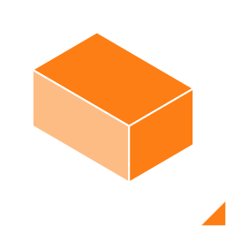
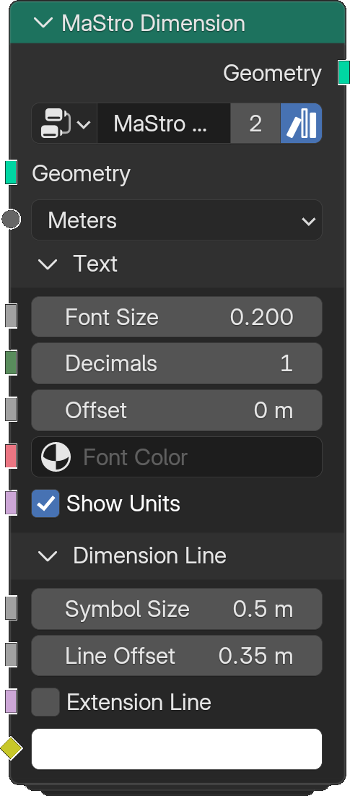
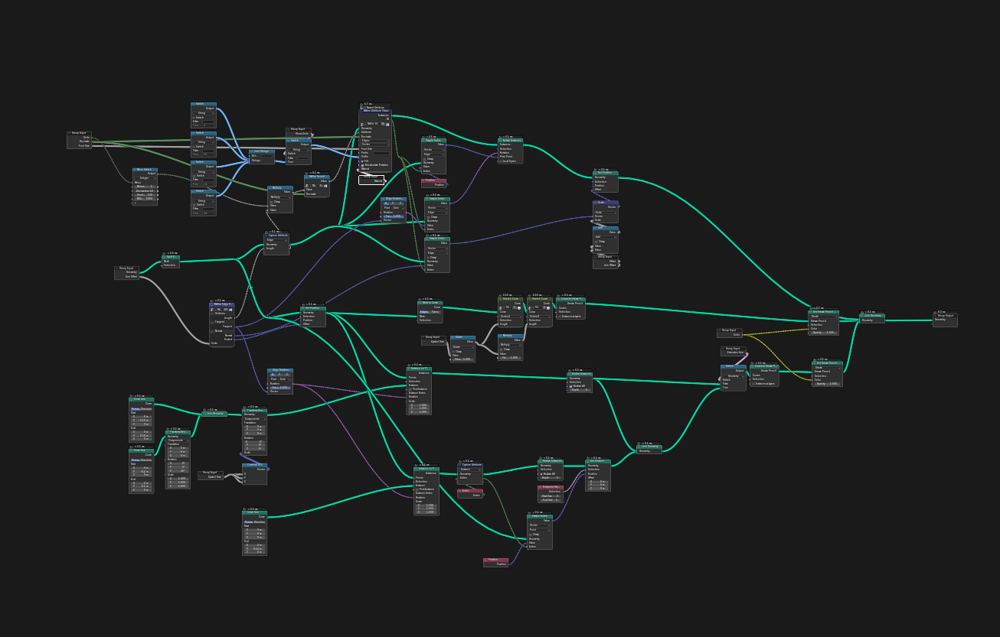
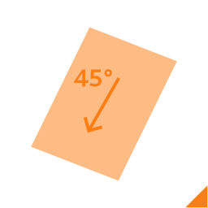
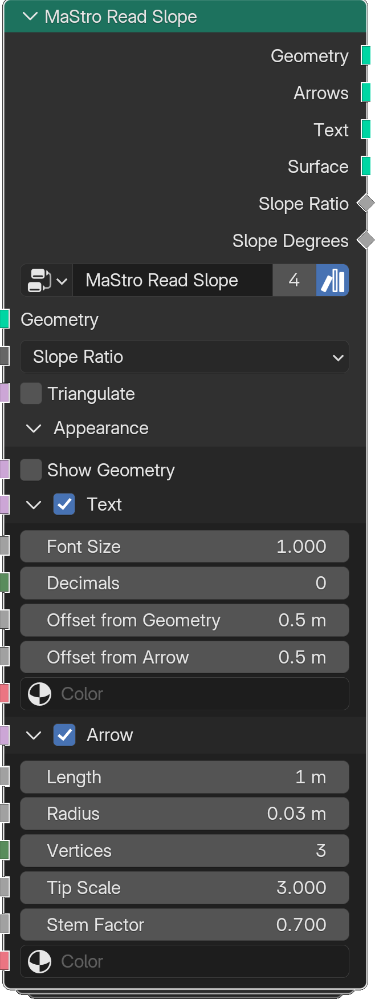

# Architecture Nodes

Architecture nodes generate building elements from the parametric data assigned by the Python layer. They are organised into sub-categories: Annotation, Façade, Mass/Building, and Structural Elements.

---

## Annotation

Annotation nodes generate technical annotations in the 3D viewport.

---

### Dimension

The **Dimension** node generates linear dimensions from the input geometry. Dimension values are calculated from the length of the referenced geometry edges.

#### Inputs

| Input | Description |
|---|---|
| **Geometry** | Input geometry used to generate the dimensions. |
| **Units** | Units for dimension values: meters, decimeters, centimeters, or millimeters. |
| **Show Units** | Displays a unit suffix next to the dimension value. |
| **Font Size** | Size of the dimension text. |
| **Decimals** | Number of decimal places. |
| **Offset** | Distance between the dimension text and the dimension line. |
| **Font Color** | Material applied to the dimension text. |
| **Symbol Size** | Size of the dimension symbols. |
| **Line Offset** | Distance between the dimension line and the referenced edge. |
| **Extension Line** | Toggles the visibility of extension lines. |
| **Dimension Color** | Color of the dimension line. |

#### Outputs

| Output | Description |
|---|---|
| **Geometry** | Dimension lines (Grease Pencil) and numeric values (mesh). |

#### Examples

---

### Read Slope

The **Read Slope** node analyses the inclination of a surface and outputs its slope as numeric values and visual indicators.

#### Inputs

| Input | Description |
|---|---|
| **Geometry** | Input geometry used to evaluate the slope. |
| **Type** | Slope representation: ratio or degrees. |
| **Triangulate** | Triangulates the input geometry to improve accuracy. |
| **Show Geometry** | Displays the input geometry with the annotations. |
| **Text** | Displays numeric slope values. |
| **Font Size** | Size of the slope text. |
| **Decimals** | Number of decimal places. |
| **Offset from Geometry** | Distance between the annotation and the surface. |
| **Offset from Arrow** | Distance between the numeric value and the arrow. |
| **Text Color** | Color of the slope value text. |
| **Arrow** | Displays an arrow indicating the slope direction. |
| **Length** | Length of the slope arrow. |
| **Radius** | Radius of the arrow shaft. |
| **Vertices** | Resolution of the arrow geometry. |
| **Tip Scale** | Scale of the arrow tip. |
| **Stem Factor** | Proportion between arrow shaft and tip. |
| **Arrow Color** | Color of the slope arrow. |

#### Outputs

| Output | Description |
|---|---|
| **Geometry** | Arrows, numeric values, and optionally the input geometry. |
| **Arrows** | Slope arrow geometry only. |
| **Text** | Numeric slope value geometry only. |
| **Slope Ratio** | Slope expressed as a ratio. |
| **Slope Degrees** | Slope expressed in degrees. |

---

### Attribute Visualiser

Displays the value of a named attribute on each element of the geometry as text in the viewport.

| Input | Description |
|---|---|
| **Geometry** | Input geometry. |
| **Attribute** | Name of the attribute to display. |
| **Decimals** | Number of decimal places. |
| **Menu** | Domain selector (vertex, edge, face, etc.). |
| **Text Alignment** | Alignment of the text label. |
| **Font Size** | Size of the text. |
| **Prefix / Suffix** | Optional text added before/after the value. |
| **Fill** | Fills the background of the text. |
| **Recalculate Position** | Recomputes label positions. |
| **Material** | Material applied to the text. |

| Output | Description |
|---|---|
| **Instances** | Text instances placed on each element. |
| **ID** | ID attribute of each instance. |

---

### Ruler

Generates a visual ruler with optional brick course overlay.

| Input | Description |
|---|---|
| **Input** | Input geometry (edge or mesh). |
| **Line Thickness** | Thickness of the ruler line. |
| **Font Size** | Size of the ruler labels. |
| **Font Fill** | Fills the label background. |
| **Ruler** | Enables the ruler overlay. |
| **Snap** | Snaps ruler marks to a fixed interval. |
| **Units** | Unit display for ruler labels. |
| **Ruler Color** | Color of the ruler. |
| **Brick** | Enables brick course overlay. |
| **Snap** | Snaps brick marks to course height. |
| **Brick Length / Depth / Mortar Size** | Brick dimensions. |
| **Brick Color / Mortar Color** | Colors for brick and mortar. |

| Output | Description |
|---|---|
| **Geometry** | Ruler and brick overlay geometry. |

---

### Reference Grid

Generates a labeled reference grid (axes and row/column markers) over a surface.

| Input | Description |
|---|---|
| **Geometry** | Input geometry. |
| **Column Width / Row Height** | Cell dimensions. |
| **Column Number / Row Number** | Grid extent. |
| **Column Offset / Row Offset Above / Row Offset Below** | Offset of grid origin. |
| **Text** | Enables axis labels. |
| **Font Size** | Size of the labels. |
| **Offset** | Distance of labels from the grid. |

| Output | Description |
|---|---|
| **Grid** | Reference grid geometry. |

---

## Façade

Façade nodes generate the visible surfaces of buildings: wall panels, openings, windows, shutters, and related elements.

---

### Façade

The main façade generator. Subdivides a building face into floor-height panels and corners.

| Input | Description |
|---|---|
| **Geometry** | Input face geometry. |
| **Floor to Floor Height** | Height of each storey. |
| **Perimeter** | Generates perimeter edges. |
| **Dissolve Aligned** | Dissolves aligned edges in the output. |
| **Fix Normals / Flip Faces** | Normal correction options. |
| **Corners / End Corners** | Handles corner and end-corner geometry. |
| **Length / Angle Threshold** | Bay subdivision parameters. |
| **Resample / Mode / Count / Length** | Resampling controls. |

| Output | Description |
|---|---|
| **Geometry** | Subdivided façade faces. |
| **Corners** | Corner geometry. |
| **Centers** | Center points of each bay. |
| **Floor to Floor Height** | Pass-through height value. |
| **Normals** | Face normals. |

---

### Façade Corner

Generates geometry for corner conditions between two façade faces.

| Input | Description |
|---|---|
| **Corners** | Corner input geometry. |
| **Height** | Storey height. |
| **Depth** | Corner depth. |
| **Corner Shape** | Shape of the corner profile. |
| **Cap Ends** | Caps the ends of the corner. |
| **Fix Normals / Reverse Normals / Flip Faces** | Normal options. |

| Output | Description |
|---|---|
| **Geometry** | Corner geometry. |
| **Footprint** | Footprint edge. |
| **Is Source Side / Is Short Side / Is Opposite Side** | Boolean selectors for each face of the corner. |

---

### Façade Pattern

Applies a repeating modular panel pattern across a façade surface.

| Input | Description |
|---|---|
| **Geometry** | Input façade geometry. |
| **Collection** | Collection of panel objects to distribute. |
| **Panel** | Panel index selector. |
| **Floor to Floor Height** | Storey height. |
| **Constant Spacing** | Uses uniform spacing regardless of bay width. |
| **Seed** | Randomisation seed. |
| **Type / Seed** | Distribution type and secondary seed. |

| Output | Description |
|---|---|
| **Geometry** | Distributed panel instances. |
| **Floor to Floor Height** | Pass-through height value. |

---

### Facade Line Based

Generates a façade from a curve or edge loop (line-based workflow).

| Input | Description |
|---|---|
| **Type** | Facade type selector. |
| **Collection** | Source collection. |
| **Geometry** | Input curve or edge geometry. |
| **Use Flip Walls / Reverse Normals** | Normal controls. |
| **Topmost Edge / Topmost Edge Height** | Controls the top edge of the façade. |

| Output | Description |
|---|---|
| **Edges** | Generated edge geometry. |
| **Floor to Floor Height** | Computed storey height. |
| **ID** | Element ID attribute. |

---

### Line Based Sum Height

Computes cumulative floor heights along a line-based façade.

| Input | Description |
|---|---|
| **Mesh** | Input mesh. |
| **Min / Max** | Height range. |
| **Show Topmost Edge** | Visualises the topmost edge. |

| Output | Description |
|---|---|
| **Geometry** | Output geometry. |
| **Floor to Floor Height** | Per-floor height. |
| **Floor to Floor Sum Height** | Cumulative height. |
| **ID** | Element ID. |

---

### Opening

Cuts a rectangular opening in a façade face and generates the surrounding wall panels.

| Input | Description |
|---|---|
| **Edge** | Input edge (base of the opening). |
| **Floor to Floor Height** | Storey height. |
| **Floor Thickness** | Floor slab thickness. |
| **Flip Faces** | Flips face normals. |
| **Opening Height / Opening Width** | Dimensions of the opening. |
| **Sill Height** | Height of the window sill. |
| **Depth** | Depth of the opening reveal. |
| **Link Height** | Links opening height to floor height. |
| **Maximise Width** | Extends opening to full bay width. |
| **Type / Factor / Distance** | Bay subdivision options. |

| Output | Description |
|---|---|
| **Panel** | Wall panel surrounding the opening. |
| **Top / Bottom / Side A / Side B** | Individual reveal faces. |
| **Opening Base Edge** | Bottom edge of the opening. |
| **Opening Height / Opening Width** | Computed opening dimensions. |

---

### Arched Opening

Cuts an arched opening in a façade face.

| Input | Description |
|---|---|
| **Edge** | Input edge (base of the opening). |
| **Opening Height** | Height of the rectangular portion. |
| **Height** | Total height including arch. |
| **Link Height to Width** | Links arch height to opening width. |
| **Arc** | Arc factor. |
| **Vertices** | Resolution of the arch curve. |

| Output | Description |
|---|---|
| **Arched Wall** | Wall geometry around the arch. |
| **Arched Opening** | The arched void. |
| **Fanlight** | Fanlight geometry above the opening. |
| **Door** | Door panel geometry. |
| **Fanlight Center Height** | Height of the fanlight center. |

---

### Triangle Opening

Cuts a triangular or grid-patterned opening in a façade face.

| Input | Description |
|---|---|
| **Edge** | Input edge. |
| **Height** | Opening height. |
| **Mode / Count / Length / Rows** | Grid subdivision parameters. |
| **Flip Faces** | Flips face normals. |
| **A / A Opening Size / B / B Opening Size** | Two-type opening sizes. |

| Output | Description |
|---|---|
| **Geometry** | Full output. |
| **Wall** | Wall panels. |
| **Opening** | Opening geometry. |
| **A / B** | Opening type selectors. |
| **Base** | Base edge geometry. |

---

### Window

Places a framed window element inside an opening.

| Input | Description |
|---|---|
| **Edge** | Input edge (opening base). |
| **Window Height** | Height of the window. |
| **Reverse / Flip Faces** | Normal options. |
| **Frame Thickness / Frame Depth** | Frame dimensions. |
| **Back of the Window** | Enables a back panel. |
| **Frame** | Frame material. |
| **Glass / Glass Offset / Glass Thickness / Flip** | Glass panel options. |

| Output | Description |
|---|---|
| **Geometry** | Full window geometry. |
| **Glass Line Base** | Base edge of the glass. |
| **Glass** | Glass panel geometry. |
| **Glass Height** | Height of the glass panel. |

---

### Awning

Adds a projecting fabric awning above an opening.

| Input | Description |
|---|---|
| **Edge** | Input edge (top of the opening). |
| **Opening Height** | Height of the opening below. |
| **Kink** | Kink angle of the awning. |
| **Length** | Projection length. |
| **Tilt** | Tilt of the awning. |
| **Mirror** | Mirrors the awning geometry. |

| Output | Description |
|---|---|
| **Edges** | All awning edges. |
| **Edge A / Edge B** | Individual sides. |
| **Fabric** | Fabric surface. |
| **End** | End panel. |

---

### Folding Shutter

Adds folding shutters to an opening.

| Input | Description |
|---|---|
| **Edge** | Input edge (opening). |
| **Opening** | Opening width factor. |
| **Thickness** | Shutter panel thickness. |
| **Subdivisions** | Number of shutter panels. |
| **Side** | Which side the shutter folds to. |
| **In/Out** | Folding direction. |

| Output | Description |
|---|---|
| **Geometry** | Shutter geometry. |
| **Thickness** | Pass-through thickness value. |

---

### Pivot Edge

Generates a pivot-hinged panel on a façade edge.

| Input | Description |
|---|---|
| **Edge** | Input edge. |
| **Menu** | Panel type selector. |
| **Opening** | Opening angle. |
| **Leaf Factor** | Proportion of the leaf. |
| **In/Out** | Opening direction. |

| Output | Description |
|---|---|
| **Geometry** | Pivot panel geometry. |

---

## Mass and Building

Nodes for generating and processing the core building volume.

---

### Mass

The main MaStro mass node. Reads typology attributes from the object and generates the full building volume with floors, walls, roof, and parapet.

| Input | Description |
|---|---|
| **Geometry** | Input footprint mesh. |
| **Floor Grid** | Enables the floor reference grid overlay. |
| **X / X Spacing / Y Spacing / Translation** | Grid parameters. |
| **Type / Wall / Floor / Roof / Parapet / Ceiling** | Material slots. |
| **Grid Scale / Font Size / Gizmos** | Grid display options. |
| **Merge By Distance** | Merges near-coincident vertices. |
| **Convert to Floor Lines** | Converts output to floor line curves. |
| **Floor Thickness** | Slab thickness. |
| **Ground Floor** | Ground floor material. |
| **Parapet / Parapet Thickness / Parapet Height** | Parapet options. |

| Output | Description |
|---|---|
| **Geometry** | Full building volume. |

---

### Mass Walls

Generates walls, floors, and roof from pre-computed floor data.

| Input | Description |
|---|---|
| **MaStro Floors** | Floor geometry from Generate Floors. |
| **Floor to Floor Height** | Storey height. |
| **Merge By Distance** | Merges near-coincident vertices. |
| **Material** | Wall material. |
| **Floor Thickness** | Slab thickness. |
| **Ground Floor / Material** | Ground floor options. |
| **Parapet / Parapet Height / Parapet Thickness** | Parapet options. |

| Output | Description |
|---|---|
| **MaStro Mass** | Full mass geometry. |
| **Wall / Floor / Ceiling / Roof / Parapet** | Individual element geometry. |
| **Floor to Floor Height** | Pass-through value. |

---

### Block

Generates a block object from a mesh footprint.

| Input | Description |
|---|---|
| **Mesh** | Input footprint mesh. |
| **Reverse** | Reverses the extrusion direction. |

| Output | Description |
|---|---|
| **Geometry** | Block geometry. |

---

### Generate Floors

Generates floor geometry from a MaStro mass object based on typology attributes.

| Input | Description |
|---|---|
| **MaStro Mass** | Input mass geometry. |
| **Random Height** | Randomises floor heights. |

| Output | Description |
|---|---|
| **MaStro Floors** | Floor geometry. |
| **Floor to Floor Height** | Computed storey height. |

---

### Generate Topology

Generates topology geometry from primary and secondary input geometry.

| Input | Description |
|---|---|
| **Main Geometry** | Primary geometry. |
| **Secondary Geometry** | Secondary geometry. |

| Output | Description |
|---|---|
| **Geometry** | Combined topology. |
| **Is Inset Face / Is Inset Boundary** | Boolean selectors. |

---

### Separate Mass

Separates a MaStro mass into individual components.

| Input | Description |
|---|---|
| **MaStro Mass** | Input mass geometry. |
| **Floor to Floor Height** | Storey height. |
| **Selection** | Element selection. |

| Output | Description |
|---|---|
| **MaStro Mass** | Full mass pass-through. |
| **Selection / Edge / Wall / Floor / Roof / Ceiling** | Individual components. |
| **Floor to Floor Height** | Pass-through value. |

---

### Convert Mass to Floor Lines

Converts a MaStro mass to a set of floor-level curve outlines.

| Input | Description |
|---|---|
| **Geometry** | Input mass geometry. |

| Output | Description |
|---|---|
| **Geometry** | Floor line curves. |

---

### Line Based Building

Generates a complete building from a curve or edge loop.

| Input | Description |
|---|---|
| **Geometry** | Input curve or edge. |
| **Floor to Floor Height** | Storey height. |
| **Number of Storeys** | Number of floors. |
| **Depth** | Building depth. |
| **In/Out** | Depth direction. |
| **Pitch Roof / Pitch Height / Type** | Roof options. |
| **Count / Length / Half End** | Bay options. |
| **Menu / Factor / Distance** | Additional parameters. |
| **Flip Horizontal / Menu / Flip Faces** | Orientation options. |

| Output | Description |
|---|---|
| **Geometry** | Building geometry. |

---

### Footprint

Extracts the footprint mesh from a set of instances.

| Input | Description |
|---|---|
| **Instances** | Input instances. |
| **Footprint Detail** | Level of detail. |

| Output | Description |
|---|---|
| **Mesh** | Footprint mesh. |
| **ID** | Instance ID. |

---

### Parapet

Extracts parapet and perimeter edges from a mass.

| Input | Description |
|---|---|
| **Mesh** | Input mesh. |
| **Floor to Floor Height** | Storey height. |
| **Move up** | Offsets the parapet edge vertically. |

| Output | Description |
|---|---|
| **Parapet Edge** | Top parapet edge. |
| **Source Mesh** | Pass-through mesh. |
| **Perimeter Edge** | Outer perimeter edge. |
| **Internal Top / Bottom Edge** | Interior top and bottom edges. |

---

### Floor Grid

Generates a reference floor grid overlay for a building object.

| Input | Description |
|---|---|
| **Geometry** | Input geometry. |
| **X / X Spacing / Y Spacing / Translation** | Grid parameters. |
| **Gizmos / Menu** | Display options. |
| **Wall / Floor / Roof / Parapet / Ceiling** | Element toggles. |
| **Grid Scale / Font Size** | Label options. |

| Output | Description |
|---|---|
| **Mesh** | Grid mesh. |

---

## Structural Elements

Nodes for stairs, roofs, vaults, and other structural components.

---

### Adaptive Stair

Generates a stair from a curve, adapting tread depth to the curve length.

| Input | Description |
|---|---|
| **Curve** | Input path curve. |
| **Curve Detail** | Curve resolution. |
| **Step Height** | Riser height. |
| **Stair Width** | Width of the stair. |
| **Stair Thickness** | Tread and riser thickness. |
| **Reverse Curve** | Reverses the stair direction. |

| Output | Description |
|---|---|
| **Geometry** | Stair geometry. |

---

### Stair

Generates a simple straight stair.

| Input | Description |
|---|---|
| **Geometry** | Input geometry. |
| **Going** | Tread depth. |
| **Width** | Stair width. |
| **Thickness** | Slab thickness. |
| **Position** | Position along the geometry. |

| Output | Description |
|---|---|
| **Geometry** | Stair geometry. |

---

### Pitch Roof

Generates a pitched roof from a building footprint.

| Input | Description |
|---|---|
| **Geometry** | Input footprint. |
| **Ridge Line Height** | Height of the ridge. |
| **Roof Pitch** | Pitch angle. |
| **Roof Plane Extrusion** | Overhang depth. |
| **Roof Plane Thickness** | Roof slab thickness. |

| Output | Description |
|---|---|
| **Geometry** | Roof geometry. |

---

### Nave

Generates a vaulted nave structure from a mesh input.

| Input | Description |
|---|---|
| **Mesh** | Input base mesh. |
| **Resolution** | Vault resolution. |
| **Vault Height** | Height of the vault. |
| **Column Height** | Height of the supporting columns. |
| **Outer / Inner / Link Offset** | Offset parameters. |
| **Outer Wall / Smooth by Angle / Outer Wall Height** | Wall options. |
| **Cap / Shade Smooth** | Cap and shading options. |

| Output | Description |
|---|---|
| **Geometry** | Nave geometry. |

---

### Vault

Generates a vault surface from a mesh face.

| Input | Description |
|---|---|
| **Geometry** | Input mesh. |
| **Menu** | Vault type selector. |
| **Grid Size** | Grid resolution. |
| **Vault Height** | Height of the vault. |
| **Triangulate** | Triangulates the vault surface. |
| **Smooth by Angle / Align Grid to Selection / Selection** | Display and alignment options. |

| Output | Description |
|---|---|
| **Geometry** | Vault geometry. |

---

### Catenary

Generates a catenary curve between two points.

| Input | Description |
|---|---|
| **Mesh** | Input mesh (provides anchor points). |
| **Type** | Catenary type. |
| **Length** | Curve length. |
| **Sag** | Sag amount. |
| **Resolution** | Curve resolution. |
| **Iterations** | Solver iterations. |
| **Value** | Additional parameter. |

| Output | Description |
|---|---|
| **Curve** | Catenary curve. |

---

### Steel Profile

Generates standard steel cross-section profiles (I, H, T, L, etc.).

| Input | Description |
|---|---|
| **Type** | Profile type (I, H, T, L, RHS, etc.). |
| **Resolution** | Curve resolution. |
| **Fill** | Fills the cross-section. |
| **h / b / tw / tf / r** | Standard profile dimensions (height, width, web thickness, flange thickness, radius). |

| Output | Description |
|---|---|
| **Geometry** | Profile cross-section geometry. |

---

### Elements - Pergola

Generates a pergola structure over a footprint.

| Input | Description |
|---|---|
| **Geometry** | Input footprint. |
| **Height** | Pergola height. |
| **Column Thickness / Beam Thickness** | Structure dimensions. |
| **Tent / Resolution / Tent Depth / Vertical Offset / Noise** | Tent canopy options. |

| Output | Description |
|---|---|
| **Geometry** | Pergola geometry. |

---

### Elements - Flag

Generates a flag on a pole.

| Input | Description |
|---|---|
| **Geometry** | Input geometry. |
| **Vertices / Radius Top / Radius Bottom / Height** | Pole dimensions. |
| **Socket / Sphere / Radius** | Pole base options. |
| **Flag / Size X / Size Y / Scale / Vertices X / Vertices Y / Wind** | Flag options. |

| Output | Description |
|---|---|
| **Geometry** | Flag and pole geometry. |

---

### Rails

Generates railing or balustrade geometry between two guide curves.

| Input | Description |
|---|---|
| **Distribution Type** | How rails are distributed. |
| **Profile** | Rail profile. |
| **Curve A / Curve B** | Guide curves. |
| **Dominant Curve** | Which curve drives the distribution. |
| **Fill Caps / Smooth / Flip Curves / Adjust** | Output options. |
| **Resampling Mode / Length / Items** | Distribution parameters. |

| Output | Description |
|---|---|
| **Instances** | Rail instances. |
| **Curve A / Curve B** | Pass-through guide curves. |

---

### Building Shadow

Computes a volumetric shadow projection for a collection of buildings.

| Input | Description |
|---|---|
| **Geometry** | Receiving geometry. |
| **Collection** | Collection of shadow-casting objects. |
| **Camera** | Camera object (defines projection direction). |
| **Clip Start / Clip Depth** | Shadow clipping range. |
| **Simplify / Voxel Size** | Simplification options. |
| **Size X / Size Y / Ray Length** | Shadow volume dimensions. |

| Output | Description |
|---|---|
| **Geometry** | Shadow geometry. |

---

### Visibility Study

Computes a visibility analysis between a geometry and a test geometry.

| Input | Description |
|---|---|
| **Geometry** | Geometry to analyse. |
| **Testing Geometry** | Geometry to test visibility against. |
| **Resolution** | Analysis resolution. |
| **Ray Length** | Maximum ray distance. |
| **Attribute** | Output attribute name. |

| Output | Description |
|---|---|
| **Geometry** | Geometry with visibility attribute. |
| **Attribute** | Computed visibility values. |
| **Distance** | Distance to visible geometry. |
