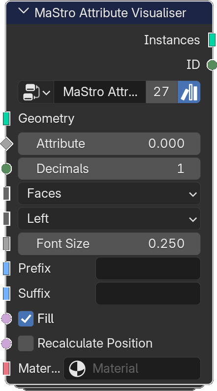

# Attribute Visualiser

*Description to be written.*

**Inputs**

<dl class="node-sockets">
<dt>Geometry</dt><dd>*Description to be written.*</dd>
<dt>Attribute</dt><dd>*Description to be written.*</dd>
<dt>Decimals</dt><dd>*Description to be written.*</dd>
<dt>Menu</dt><dd>*Description to be written.*</dd>
<dt>Text Alignment</dt><dd>*Description to be written.*</dd>
<dt>Font Size</dt><dd>*Description to be written.*</dd>
<dt>Prefix</dt><dd>*Description to be written.*</dd>
<dt>Suffix</dt><dd>*Description to be written.*</dd>
<dt>Fill</dt><dd>*Description to be written.*</dd>
<dt>Recalculate Position</dt><dd>If False, instance position is (0,0,0). If True, position is calculated</dd>
<dt>Material</dt><dd>*Description to be written.*</dd>
</dl>

**Outputs**

<dl class="node-sockets">
<dt>Instances</dt><dd>*Description to be written.*</dd>
<dt>ID</dt><dd>*Description to be written.*</dd>
</dl>

