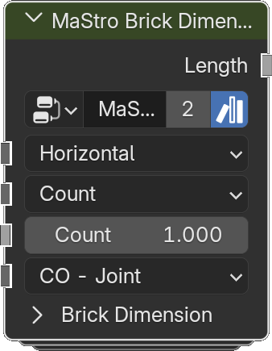

# Brick Dimension

*Description to be written.*

**Inputs**

<dl class="node-sockets">
<dt>Orientation</dt><dd>Horizontal or vertical brick courses</dd>
<dt>Type</dt><dd>*Description to be written.*</dd>
<dt>Length</dt><dd>*Description to be written.*</dd>
<dt>Height</dt><dd>*Description to be written.*</dd>
<dt>Count</dt><dd>*Description to be written.*</dd>
<dt>Count</dt><dd>*Description to be written.*</dd>
<dt>Coordination</dt><dd>*Description to be written.*</dd>

Brick Dimension

<dt>Length</dt><dd>Units are mm</dd>
<dt>Height</dt><dd>Units are mm</dd>
<dt>Mortar</dt><dd>Units are mm</dd>
</dl>

**Outputs**

<dl class="node-sockets">
<dt>Length</dt><dd>*Description to be written.*</dd>
</dl>

