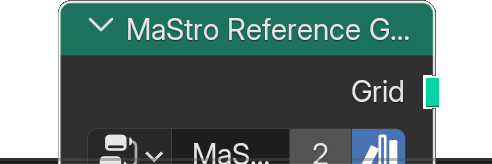

# Reference Grid

*Description to be written.*

**Inputs**

<dl class="node-sockets">
<dt>Geometry</dt><dd>*Description to be written.*</dd>
<dt>Column Width</dt><dd>*Description to be written.*</dd>
<dt>Row Height</dt><dd>*Description to be written.*</dd>
<dt>Column Number</dt><dd>*Description to be written.*</dd>
<dt>Row Number</dt><dd>*Description to be written.*</dd>

Secondary Grid

<dt>Column Offset</dt><dd>*Description to be written.*</dd>
<dt>Row Offset Above</dt><dd>*Description to be written.*</dd>
<dt>Row Offset Below</dt><dd>*Description to be written.*</dd>

Text

<dt>Text</dt><dd>*Description to be written.*</dd>
<dt>Font Size</dt><dd>*Description to be written.*</dd>
<dt>Offset</dt><dd>*Description to be written.*</dd>
</dl>

**Outputs**

<dl class="node-sockets">
<dt>Grid</dt><dd>*Description to be written.*</dd>
</dl>

