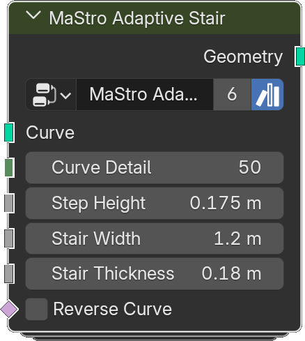

# Adaptive Stair

*Description to be written.*

**Inputs**

<dl class="node-sockets">
<dt>Curve</dt><dd>*Description to be written.*</dd>
<dt>Curve Detail</dt><dd>*Description to be written.*</dd>
<dt>Step Height</dt><dd>*Description to be written.*</dd>
<dt>Stair Width</dt><dd>*Description to be written.*</dd>
<dt>Stair Thickness</dt><dd>*Description to be written.*</dd>
<dt>Reverse Curve</dt><dd>*Description to be written.*</dd>
</dl>

**Outputs**

<dl class="node-sockets">
<dt>Geometry</dt><dd>*Description to be written.*</dd>
</dl>

