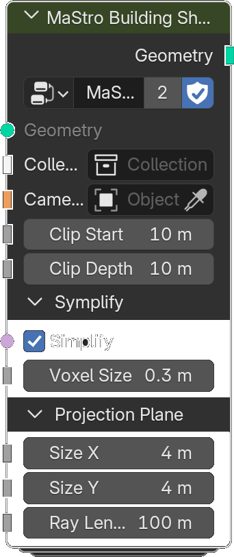

# Building Shadow

*Description to be written.*

**Inputs**

<dl class="node-sockets">
<dt>Geometry</dt><dd>*Description to be written.*</dd>
<dt>Collection</dt><dd>*Description to be written.*</dd>
<dt>Camera</dt><dd>*Description to be written.*</dd>
<dt>Clip Start</dt><dd>*Description to be written.*</dd>
<dt>Clip Depth</dt><dd>*Description to be written.*</dd>

Symplify

<dt>Simplify</dt><dd>*Description to be written.*</dd>
<dt>Voxel Size</dt><dd>*Description to be written.*</dd>

Projection Plane

<dt>Size X</dt><dd>*Description to be written.*</dd>
<dt>Size Y</dt><dd>*Description to be written.*</dd>
<dt>Ray Length</dt><dd>*Description to be written.*</dd>
</dl>

**Outputs**

<dl class="node-sockets">
<dt>Geometry</dt><dd>*Description to be written.*</dd>
</dl>

