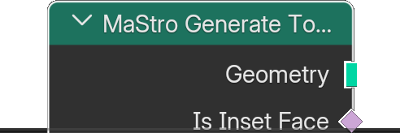

# Generate Topology

*Description to be written.*

**Inputs**

<dl class="node-sockets">
<dt>Main Geometry</dt><dd>*Description to be written.*</dd>
<dt>Secondary Geometry</dt><dd>*Description to be written.*</dd>
</dl>

**Outputs**

<dl class="node-sockets">
<dt>Geometry</dt><dd>*Description to be written.*</dd>
<dt>Is Inset Face</dt><dd>*Description to be written.*</dd>
<dt>Is Inset Boundary</dt><dd>*Description to be written.*</dd>
</dl>

