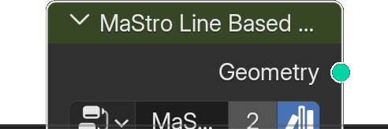

# Line Based Building

*Description to be written.*

**Inputs**

<dl class="node-sockets">
<dt>Geometry</dt><dd>*Description to be written.*</dd>
<dt>Floor to Floor Height</dt><dd>*Description to be written.*</dd>
<dt>Number of Storeys</dt><dd>*Description to be written.*</dd>
<dt>Depth</dt><dd>*Description to be written.*</dd>
<dt>In/Out</dt><dd>*Description to be written.*</dd>

Pitch Roof

<dt>Pich Roof</dt><dd>*Description to be written.*</dd>
<dt>Pitch Height</dt><dd>*Description to be written.*</dd>
<dt>Type</dt><dd>*Description to be written.*</dd>
<dt>Count</dt><dd>*Description to be written.*</dd>
<dt>Length</dt><dd>*Description to be written.*</dd>
<dt>Half End</dt><dd>*Description to be written.*</dd>
<dt>Menu</dt><dd>*Description to be written.*</dd>
<dt>Factor</dt><dd>*Description to be written.*</dd>
<dt>Distance</dt><dd>*Description to be written.*</dd>
<dt>Flip Horizontal</dt><dd>*Description to be written.*</dd>
<dt>Menu</dt><dd>*Description to be written.*</dd>
<dt>Flip Faces</dt><dd>*Description to be written.*</dd>
</dl>

**Outputs**

<dl class="node-sockets">
<dt>Geometry</dt><dd>*Description to be written.*</dd>
</dl>

