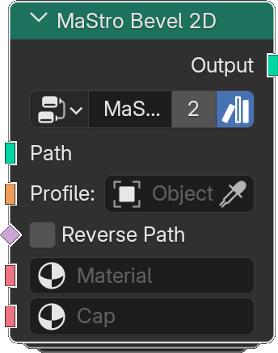

# Bevel 2D

*Description to be written.*

**Inputs**

<dl class="node-sockets">
<dt>Path</dt><dd>*Description to be written.*</dd>
<dt>Profile</dt><dd>*Description to be written.*</dd>
<dt>Reverse Path</dt><dd>*Description to be written.*</dd>
<dt>Material</dt><dd>*Description to be written.*</dd>
<dt>Cap</dt><dd>*Description to be written.*</dd>
</dl>

**Outputs**

<dl class="node-sockets">
<dt>Output</dt><dd>*Description to be written.*</dd>
</dl>

