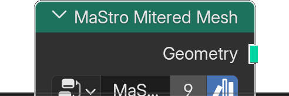

# Mitered Mesh

*Description to be written.*

**Inputs**

<dl class="node-sockets">
<dt>Path</dt><dd>*Description to be written.*</dd>
<dt>Profile</dt><dd>*Description to be written.*</dd>
<dt>Reverse Curve</dt><dd>*Description to be written.*</dd>
<dt>Mirror X</dt><dd>*Description to be written.*</dd>
<dt>Mirror Y</dt><dd>*Description to be written.*</dd>
<dt>Flip Faces</dt><dd>*Description to be written.*</dd>
<dt>Shade Smooth</dt><dd>*Description to be written.*</dd>
<dt>Fill Caps</dt><dd>*Description to be written.*</dd>
</dl>

**Outputs**

<dl class="node-sockets">
<dt>Geometry</dt><dd>*Description to be written.*</dd>
</dl>

