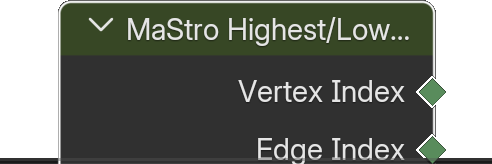

# Highest/Lowest Edge Index

*Description to be written.*

**Inputs**

<dl class="node-sockets">
<dt>Input</dt><dd>*Description to be written.*</dd>
</dl>

**Outputs**

<dl class="node-sockets">
<dt>Vertex Index</dt><dd>*Description to be written.*</dd>
<dt>Edge Index</dt><dd>*Description to be written.*</dd>
</dl>

