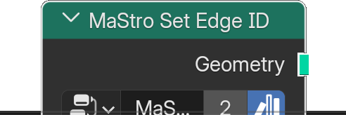

# Set Edge ID

*Description to be written.*

**Inputs**

<dl class="node-sockets">
<dt>Mesh</dt><dd>Mesh to convert to curves</dd>
</dl>

**Outputs**

<dl class="node-sockets">
<dt>Geometry</dt><dd>*Description to be written.*</dd>
</dl>

