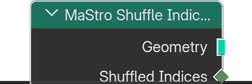

# Shuffle Indices

*Description to be written.*

**Inputs**

<dl class="node-sockets">
<dt>Geometry</dt><dd>*Description to be written.*</dd>
<dt>Domain</dt><dd>*Description to be written.*</dd>
<dt>Seed</dt><dd>*Description to be written.*</dd>
</dl>

**Outputs**

<dl class="node-sockets">
<dt>Geometry</dt><dd>*Description to be written.*</dd>
<dt>Shuffled Indices</dt><dd>*Description to be written.*</dd>
</dl>

