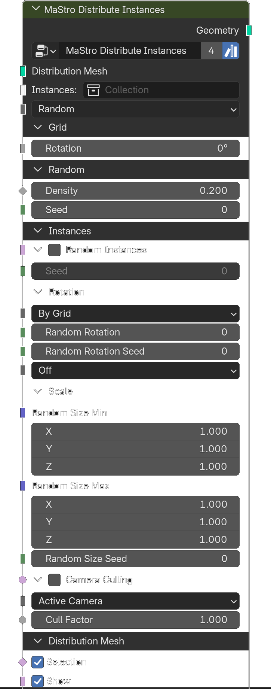

# Distribute Instances

*Description to be written.*

**Inputs**

<dl class="node-sockets">
<dt>Distribution Mesh</dt><dd>*Description to be written.*</dd>
<dt>Instances</dt><dd>*Description to be written.*</dd>
<dt>Type</dt><dd>Distribution Type</dd>

Grid

<dt>Size X</dt><dd>*Description to be written.*</dd>
<dt>Size Y</dt><dd>*Description to be written.*</dd>
<dt>Grid Rotation</dt><dd>*Description to be written.*</dd>

Random

<dt>Density</dt><dd>*Description to be written.*</dd>
<dt>Seed</dt><dd>*Description to be written.*</dd>

Poisson Disk

<dt>Distance Min</dt><dd>*Description to be written.*</dd>
<dt>Density Max</dt><dd>*Description to be written.*</dd>
<dt>Density Factor</dt><dd>*Description to be written.*</dd>
<dt>Seed</dt><dd>*Description to be written.*</dd>

Random Instances

<dt>Random Instances</dt><dd>*Description to be written.*</dd>
<dt>Random Instances Seed</dt><dd>*Description to be written.*</dd>

Rotation

<dt>Rotation</dt><dd>*Description to be written.*</dd>
<dt>Instances Rotation</dt><dd>*Description to be written.*</dd>
<dt>Reference Object</dt><dd>*Description to be written.*</dd>
<dt>Reference Objects</dt><dd>*Description to be written.*</dd>
<dt>Random Rotation</dt><dd>Random rotation angle to add to the rotation of the instances</dd>
<dt>Random Rotation Seed</dt><dd>*Description to be written.*</dd>
<dt>Random Mirror</dt><dd>*Description to be written.*</dd>

Scale

<dt>Random Size Min</dt><dd>*Description to be written.*</dd>
<dt>Random Size Max</dt><dd>*Description to be written.*</dd>
<dt>Random Size Seed</dt><dd>*Description to be written.*</dd>

Camera Culling

<dt>Camera Culling</dt><dd>*Description to be written.*</dd>
<dt>Cull By</dt><dd>*Description to be written.*</dd>
<dt>Object</dt><dd>*Description to be written.*</dd>
<dt>Cull Factor</dt><dd>*Description to be written.*</dd>

Distribution Mesh

<dt>Selection</dt><dd>*Description to be written.*</dd>
<dt>Show</dt><dd>*Description to be written.*</dd>
<dt>Offset</dt><dd>*Description to be written.*</dd>
</dl>

**Outputs**

<dl class="node-sockets">
<dt>Geometry</dt><dd>*Description to be written.*</dd>
</dl>

