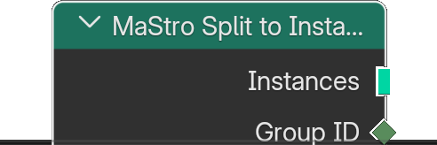

# Split to Instances

*Description to be written.*

**Inputs**

<dl class="node-sockets">
<dt>Geometry</dt><dd>Points to modify the positions of</dd>
<dt>Group ID</dt><dd>*Description to be written.*</dd>
<dt>Instance Origin</dt><dd>*Description to be written.*</dd>
</dl>

**Outputs**

<dl class="node-sockets">
<dt>Instances</dt><dd>*Description to be written.*</dd>
<dt>Group ID</dt><dd>The group ID of each group instance</dd>
</dl>

