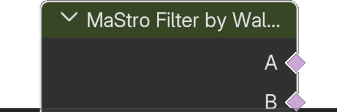

# Filter by Wall Type

*Description to be written.*

**Outputs**

<dl class="node-sockets">
<dt>A</dt><dd>id: 0 - A</dd>
<dt>B</dt><dd>id: 1 - B</dd>
<dt>10</dt><dd>id: 2 - 10</dd>
<dt>30</dt><dd>id: 3 - 30</dd>
<dt>20</dt><dd>id: 4 - 20</dd>
</dl>

