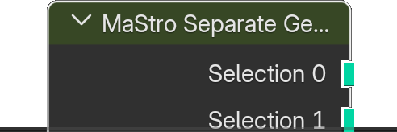

# Separate Geometry by Factor.001

*Description to be written.*

**Inputs**

<dl class="node-sockets">
<dt>Geometry</dt><dd>*Description to be written.*</dd>
<dt>Seed</dt><dd>Seed for the random value</dd>
<dt>Subdivisions</dt><dd>The number of subdivisions. This is used only to store data. To plug the socket does nothing. If you want to change the number of subdivisions use the panel Node->RoMa</dd>
<dt>Split 0</dt><dd>The number of subdivisions</dd>
<dt>Split 1</dt><dd>The number of subdivisions</dd>
</dl>

**Outputs**

<dl class="node-sockets">
<dt>Selection 0</dt><dd>*Description to be written.*</dd>
<dt>Selection 1</dt><dd>*Description to be written.*</dd>
<dt>Remaining</dt><dd>*Description to be written.*</dd>
</dl>

