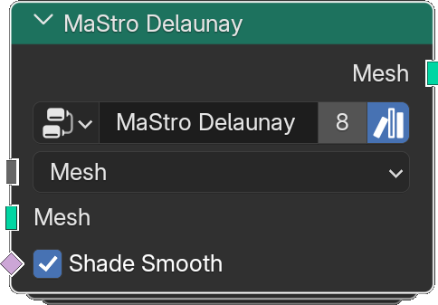

# Delaunay

*Description to be written.*

**Inputs**

<dl class="node-sockets">
<dt>Type</dt><dd>*Description to be written.*</dd>
<dt>Mesh</dt><dd>*Description to be written.*</dd>
<dt>Boundary</dt><dd>*Description to be written.*</dd>
<dt>Inner Points</dt><dd>*Description to be written.*</dd>
<dt>Shade Smooth</dt><dd>*Description to be written.*</dd>
</dl>

**Outputs**

<dl class="node-sockets">
<dt>Mesh</dt><dd>*Description to be written.*</dd>
</dl>

