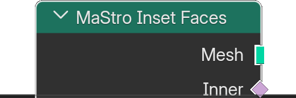

# Inset Faces

*Description to be written.*

**Inputs**

<dl class="node-sockets">
<dt>Mesh</dt><dd>*Description to be written.*</dd>
<dt>Selection</dt><dd>*Description to be written.*</dd>
<dt>Offset Scale</dt><dd>*Description to be written.*</dd>
</dl>

**Outputs**

<dl class="node-sockets">
<dt>Mesh</dt><dd>*Description to be written.*</dd>
<dt>Inner</dt><dd>*Description to be written.*</dd>
<dt>Outer</dt><dd>*Description to be written.*</dd>
</dl>

