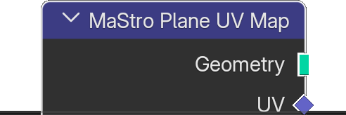

# Plane UV Map

*Description to be written.*

**Inputs**

<dl class="node-sockets">
<dt>Edge</dt><dd>Mesh whose edges to split</dd>
<dt>Offset Scale</dt><dd>*Description to be written.*</dd>
<dt>Tilt</dt><dd>*Description to be written.*</dd>
<dt>Center Map</dt><dd>*Description to be written.*</dd>
<dt>Fit to Face</dt><dd>*Description to be written.*</dd>
</dl>

**Outputs**

<dl class="node-sockets">
<dt>Geometry</dt><dd>*Description to be written.*</dd>
<dt>UV</dt><dd>*Description to be written.*</dd>
</dl>

