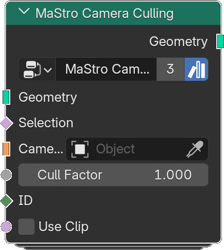

# Camera Culling

*Description to be written.*

**Inputs**

<dl class="node-sockets">
<dt>Geometry</dt><dd>*Description to be written.*</dd>
<dt>Selection</dt><dd>*Description to be written.*</dd>
<dt>Camera</dt><dd>*Description to be written.*</dd>
<dt>Cull Factor</dt><dd>*Description to be written.*</dd>
<dt>ID</dt><dd>*Description to be written.*</dd>
<dt>Use Clip</dt><dd>*Description to be written.*</dd>
</dl>

**Outputs**

<dl class="node-sockets">
<dt>Geometry</dt><dd>*Description to be written.*</dd>
</dl>

