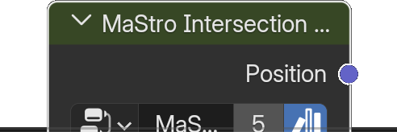

# Intersection Between Line and Plane

*Description to be written.*

**Inputs**

<dl class="node-sockets">
<dt>A</dt><dd>*Description to be written.*</dd>
<dt>B</dt><dd>*Description to be written.*</dd>
<dt>Plane Normal</dt><dd>*Description to be written.*</dd>
<dt>Point on the Plane</dt><dd>*Description to be written.*</dd>
</dl>

**Outputs**

<dl class="node-sockets">
<dt>Position</dt><dd>*Description to be written.*</dd>
</dl>

