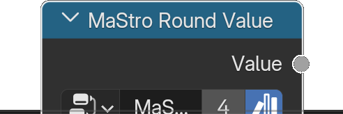

# Round Value

*Description to be written.*

**Inputs**

<dl class="node-sockets">
<dt>Value</dt><dd>*Description to be written.*</dd>
<dt>Decimals</dt><dd>*Description to be written.*</dd>
</dl>

**Outputs**

<dl class="node-sockets">
<dt>Value</dt><dd>*Description to be written.*</dd>
</dl>

