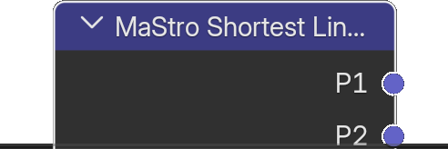

# Shortest Line Between Lines in 3D

*Description to be written.*

**Inputs**

<dl class="node-sockets">
<dt>A1</dt><dd>*Description to be written.*</dd>
<dt>A2</dt><dd>*Description to be written.*</dd>
<dt>B1</dt><dd>*Description to be written.*</dd>
<dt>B2</dt><dd>*Description to be written.*</dd>
</dl>

**Outputs**

<dl class="node-sockets">
<dt>P1</dt><dd>Point on segment A</dd>
<dt>P2</dt><dd>Point on segment B</dd>
<dt>Middle Point</dt><dd>Middle point between P1 and P2</dd>
<dt>P1P2 Vector</dt><dd>P1P2 Vector</dd>
<dt>Intersecting</dt><dd>*Description to be written.*</dd>
<dt>Is P1 On Edge</dt><dd>*Description to be written.*</dd>
<dt>Is P2 On Edge</dt><dd>*Description to be written.*</dd>
<dt>P1 P2 Distance</dt><dd>P1 P2 Distance</dd>
<dt>Value</dt><dd>*Description to be written.*</dd>
</dl>

