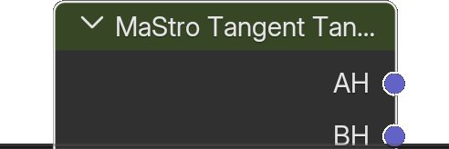

# Tangent Tangent Center

*Description to be written.*

**Inputs**

<dl class="node-sockets">
<dt>A</dt><dd>*Description to be written.*</dd>
<dt>B</dt><dd>*Description to be written.*</dd>
<dt>O</dt><dd>*Description to be written.*</dd>
<dt>Radius</dt><dd>*Description to be written.*</dd>
</dl>

**Outputs**

<dl class="node-sockets">
<dt>AH</dt><dd>*Description to be written.*</dd>
<dt>BH</dt><dd>*Description to be written.*</dd>
<dt>Fillet center</dt><dd>*Description to be written.*</dd>
</dl>

