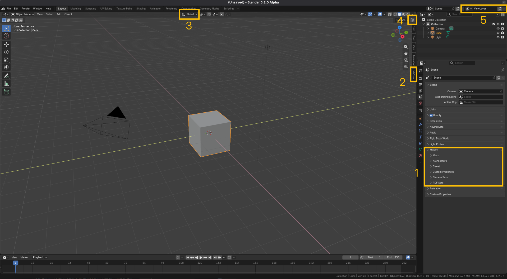

# User interface

MaStro alters or add new features in several location of the user interface (UI) of Blender.

Some of this places are:

1. The MaStro Panel in the Properties Editor
2. The MaStro Panel in the View3D sidebar
3. Menu in the center of the View3D header
4. Menu at the right hand side of the View3D header
5. The view layer manager in the Blender topbar

Some of these menues are dynamic and can change their context accordingly to the active object, or activated mode.

!!! note
    Testo della nota.

!!! tip
    Consiglio utile.

!!! warning
    Attenzione a questo.

!!! seealso "Reference"
    **Mode:** Object Mode  
    **Menu:** Object ▸ Set Origin